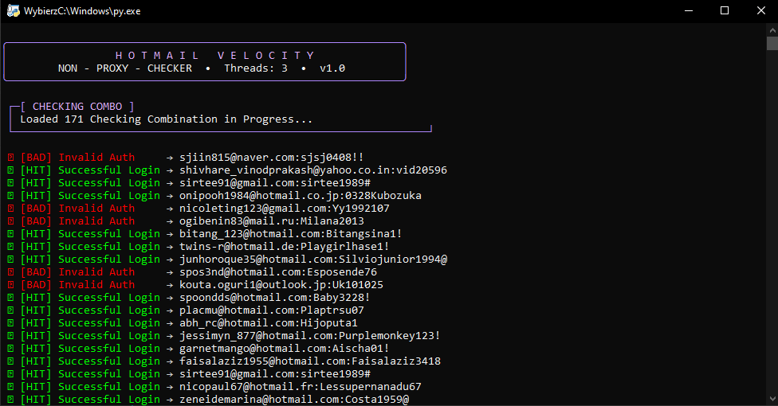

# 🚀 Hotmail Velocity Checker

A simple and fast Python program used for checking the status and performance of Hotmail accounts

## 📋 Requirements & Installation

This program requires **Python 3** and the `requests` library installed

1. Download the project code (by clicking the green **Code -> Download ZIP** button on GitHub) and extract it
2. Open your terminal / command prompt in the project folder and install the required library:

```bash
pip install requests
```

## 🚀 How to Run

The program is fully optimized for quick startup on Windows systems:

* Simply **double-click** the main file `Hotmail_VeloCity.py` to launch the tool

## 📸 Showcase





## 🛠️ Features

* Fast Hotmail account checking
* Built on the lightweight and efficient `requests` library
* User-friendly interface that launches with a single click
* The tool functions without any proxies
